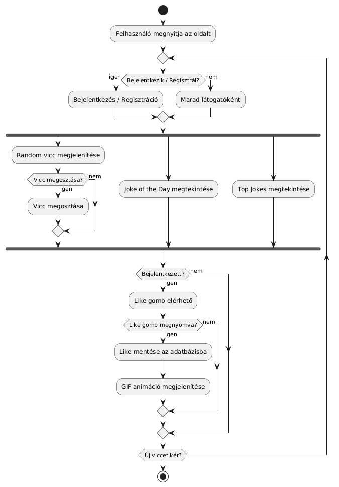
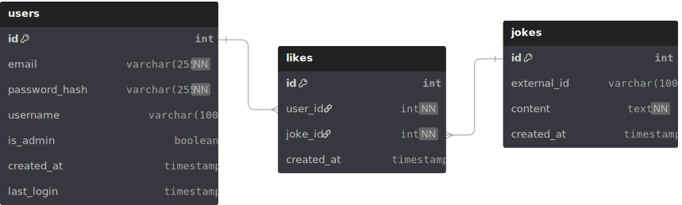

# Rendszerterv

## A rendszer célja

A rendszer célja, hogy a látogatók és felhasználók véletlenszerűen generált vicceket tudjanak lekérni. A látogatók regisztrálhatnak, a felhasználók bejelentkezhetnek, melyet követően lehetőség van a viccek kedvelésére. A kedveléskor az adott vicc bekerül az adatbázisba, mely alapján egy top jokes statisztika készül el. A weboldal egyszerű, reszponzív felületet kap a könnyen kezelhetőség érdekében. A rendszer további funkciói: napi „Joke of the Day”, like visszajelző GIF animáció, valamint vicc megosztás.

## Projektterv

**Ütemterv:**
| Funkció/Story            | Feladat/Task                                                         | Prioritás | Becslés (óra) | Eltelt idő (óra) | Hátralévő idő (óra) |
| ------------------------ | -------------------------------------------------------------------- | --------- | ------------- | ---------------- | ------------------- |
| Követelmény specifikáció | Követelmények összegyűjtése, leírása                                 | 1         | 4             | 0                | 4                   |
| Rendszerterv             | Architektúra, adatbázis és komponensek tervezése                     | 1         | 6             | 0                | 6                   |
| Backend fejlesztés       | API-k, adatbázis kezelése, üzleti logika, like és toplista funkciók  | 1         | 24            | 0                | 24                  |
| Frontend fejlesztés      | UI komponensek, navigáció, interakciók, GIF-ek és megosztás kezelése | 1         | 24            | 0                | 24                  |
| Tesztelés                | Funkcionális és integrációs tesztek, hibajavítás                     | 2         | 10            | 0                | 10                  |


## Üzleti folyamatok modellje


## Követelmények 

**Funkcionális követelmények:**
* **Látogatók**: 
  - Véletlenszerűen generált viccek lekérése
  - Regisztrációs lehetőség
  - Top viccek megtekintése
  - Napi „Joke of the Day” megtekintése

* **Regisztrált felhasználó**
  - Oldalra való bejelentkezés
  - Véletlenszerűen generált viccek lekérése
  - Viccek kedvelése (Like GIF visszajelzéssel)
  - Top viccek megtekintése
  - Profiladatok módosítása
  - Napi „Joke of the Day” megtekintése
  - Viccek megosztása közösségi felületeken
  
* **Adminisztrációs funkciók**
  - Felhasználók kezelése
  - Viccek statisztikáinak megtekintése
  
* **Rendszer funkciók**
  - Biztonságos hitelesítés
  - Adatbázisban viccek, kedvelések tárolása
  - Hibakezelés
  - Napi kiemelt vicc („Joke of the Day”) generálása
  - Viccek megosztásának támogatása
  - Like eseményhez GIF animáció megjelenítése

**Nem funkcionális követelmények:**

* **Használhatóság:**

  - A rendszer felülete legyen egyszerű, áttekinthető és könnyen kezelhető.
  - A felület reszponzív legyen, azaz mobilon, tableten és asztali gépen is megfelelően működjön.

* **Biztonság:**

  - A jelszavakat titkosított formában kell tárolni az adatbázisban.
  - A rendszer védve legyen az alapvető támadásokkal szemben (pl. SQL injection, XSS).
  - Csak a bejelentkezett felhasználók férhetnek hozzá a kedvelési funkcióhoz.

* **Bővíthetőség és karbantarthatóság:**

  - A kód legyen jól dokumentált a könnyebb karbantartás érdekében.
  
**Törvényi előírások, szabványok:**
  - GDPR-nek való megfelelés.

## Funkcionális terv

**Rendszerszereplők:**
* Bejelentkezett felhasználó
* Látogató

### Rendszerhasználati esetek és lefutásaik

#### 1. Látogató

**1.1. Véletlenszerű vicc lekérése**

**Lefutás:**
1. A látogató megnyitja a főoldalt.
2. A rendszer automatikusan lekér egy random viccet az API-tól.
3. A vicc megjelenik a felületen.
4. A látogató új viccet kérhet a „Generate Joke” gombbal.
   
**1.2. Bejelentkezés**

**Lefutás:**
1. A felhasználó megadja email-címét és jelszavát.
2. A backend ellenőrzi a hitelességet.
3. A felhasználó átirányítódik a főoldalra.
  
**1.3. Regisztráció**

**Lefutás:**
1. A látogató megnyitja a „Register” oldalt.
2. Megadja a szükséges adatokat.
3. A rendszer ellenőrzi a mezőket.
4. Ha minden helyes, a felhasználó rekord létrejön az adatbázisban.

**1.4. Top Jokes megtekintése**

**Lefutás:**
1. A látogató a menüből kiválasztja a „Top Jokes” menüpontot.
2. A rendszer az adatbázisból lekéri a legtöbb like-ot kapott vicceket.
3. A lista megjelenik.

**1.5. Joke of the Day megtekintése**

**Lefutás:**
1. A látogató kiválasztja a „Joke of the Day” oldalt.
2. A rendszer az aznapi előre generált viccet mutatja.
3. A látogató bármikor visszatérhet és újra megtekintheti.

**1.6. Vicc megosztása** 

**Lefutás**
1. A felhasználó a főoldalon vagy vicc részleteinél lát egy viccet.
2. A felhasználó a „Share” (Megosztás) gombra kattint.
3. A rendszer megjelenít egy megosztási panelt
4. A felhasználó kiválasztja a kívánt megosztási módot.
5. A rendszer generál egy egyedi URL-t vagy előre kitöltött megosztási formát a platformnak megfelelően.
6. A felhasználó megerősíti a megosztást vagy a link másolását.
7. A felhasználó visszatérhet a viccek böngészéséhez, vagy megosztás után azonnal új viccet kérhet.

#### 2. Bejelentkezett felhasználó

**2.1. Vicc kedvelése**

**Lefutás:**
1. A felhasználó lát egy random viccet.
2. A „Like” gombra kattint.
3. A rendszer eltárolja a like-ot az adatbázisban.
4. Megjelenik a visszajelző GIF animáció.

**2.2. Vicc megosztása**

**Lefutás:**
1. A felhasználó a főoldalon vagy vicc részleteinél lát egy viccet.
2. A felhasználó a „Share” (Megosztás) gombra kattint.
3. A rendszer megjelenít egy megosztási panelt
4. A felhasználó kiválasztja a kívánt megosztási módot.
5. A rendszer generál egy egyedi URL-t vagy előre kitöltött megosztási formát a platformnak megfelelően.
6. A felhasználó megerősíti a megosztást vagy a link másolását.
7. A felhasználó visszatérhet a viccek böngészéséhez, vagy megosztás után azonnal új viccet kérhet.

**2.3. Kijelentkezés**

**Lefutás:**
1. A felhasználó a menüből a „Logout”-ot választja.
2. A rendszer törli a JWT tokent a böngészőből.
3. Visszairányít a főoldalra.

**2.4. Top Jokes megtekintése**

**Lefutás:**
1. A látogató a menüből kiválasztja a „Top Jokes” menüpontot.
2. A rendszer az adatbázisból lekéri a legtöbb like-ot kapott vicceket.
3. A lista megjelenik.

**2.5. Joke of the Day megtekintése**

**Lefutás:**
1. A látogató kiválasztja a „Joke of the Day” oldalt.
2. A rendszer az aznapi előre generált viccet mutatja.
3. A látogató bármikor visszatérhet és újra megtekintheti.

### Határ osztályok

| Képernyő | Funkciók |
|---------|----------|
| **LandingPage** | Random vicc megjelenítése, új vicc kérés |
| **LoginPage** | Bejelentkezés |
| **RegisterPage** | Regisztráció |
| **TopJokesPage** | Top viccek listázása |
| **JokeOfTheDayPage** | Napi vicc megjelenítése |
| **Navbar/Menu** | Navigáció, kijelentkezés |

### Képernyőtervek
https://www.figma.com/design/zJWeR8xnlT0Oax8glcPbqk/SZFM?node-id=0-1&p=f&t=H5fljHKI22Zgi2UM-0

### Aktitivtási diagram


## Fizikai környezet

Az alkalmazás 3 komponensből áll. A frontend egy webes felület, amely a modern böngészők legtöbbjén kompatibilis lesz. A backend linux rendszerre tervezett alkalmazás. Az adatbázis PostgreSQL DBMS.

A fejlesztés során integrált fejlesztői környezeteket (Visual Studio Code, IntelliJ PyCharm), konténerizációs eszközöket (Docker, Podman) és a teszteléshez szükséges alkalmazásokat (Chrome, Firefox, Postman) használunk.

## Architekturális terv

**Front-end:** A webalkalmazás front-endje a React JS könyvtár használatával készül el.

**Back-end:** A komponens Python nyelven íródik, a Django keretrendszer használatával.

**Adatbázis:** PostgreSQL DBMS alapú relációs adatbázis

## Adatbázis terv

```
Table users {
  id int [pk, increment]
  email varchar(255) [not null, unique]
  password_hash varchar(255) [not null]
  username varchar(100)
  is_admin boolean [default: false]
  created_at timestamp [default: `CURRENT_TIMESTAMP`]
  last_login timestamp
}

Table jokes {
  id int [pk, increment]
  external_id varchar(100) [unique]
  content text [not null]
  created_at timestamp [default: `CURRENT_TIMESTAMP`]
}

Table likes {
  id int [pk, increment]
  user_id int [not null, ref: > users.id]
  joke_id int [not null, ref: > jokes.id]
  created_at timestamp [default: `CURRENT_TIMESTAMP`]
}
```


## Implementációs terv

**Web:** A webes felület főként HTML, CSS és Javascript nyelven fog készülni. Ezeket a technológiákat amennyire csak lehet külön fájlokba írva készítjük, és úgy fogjuk egymáshoz csatolni a jobb átláthatóság, könnyebb változtathatóság, és könnyebb bővítés érdekében.

**Back-end:** A backend API Python nyelvben, Django keretrendszerben fog készülni. A webes frontend REST API-on keresztül érheti el, JWT authentikációval védve.

## Tesztterv

A tesztelések célja a rendszer és komponensei funkcionalitásának teljes vizsgálata, ellenőrzése, a rendszer által megvalósított üzleti szolgáltatások verifikálása.

Tesztelési eljárások:
- Egységtesztelés: A kódrészek megfelelő működésének biztosítása fejlesztés idejében írt tesztesetekkel.
- Integrációs/regressziós tesztek: A nagyobb komponensek közös működésének biztosítása teljes folyamatok tesztelésével.
- Alfa/beta tesztek: belső és külső manuális tesztelés a felhasználói élmény biztosítására és a szélsőséges esetek kiszűrésére.

Tesztelendő funkciók:
- Backend: egyidejűleg több kliens kiszolgálása, az adatbázis olvasása és írása
- Frontend: a meghatározott funkciók biztosítása igényes, intuitív és hozzáférhető módon

### Test case

| Test Case ID | Cél                             | Módszer / Steps                                          | Várt eredmény                                               | 
| ------------ | ------------------------------- | -------------------------------------------------------- | ----------------------------------------------------------- | 
| TC001        | Viccek listázása                | GET `/api/jokes/`                                        | JSON lista a viccekről, status 200                          | 
| TC002        | Egy vicc lekérése               | GET `/api/jokes/<id>/`                                   | JSON a megadott viccről, status 200                         | 
| TC003        | Lájkok listázása                | GET `/api/jokes/<id>/likes/`                             | JSON lista lájkokról, status 200                            |
| TC004        | Lájk hozzáadása                 | POST `/api/jokes/<id>/likes/`                            | Lájk rögzül, status 201                                     | 
| TC005        | Lájk törlése                    | DELETE `/api/jokes/<id>/likes/`                          | Lájk törlődik, status 204                                   | 
| TC006        | Bejelentkezés                   | POST `/auth/token/` body: `{email, password}`            | JSON access és refresh token, status 200                    | 
| TC007        | Regisztráció                    | POST `/auth/register/` body: `{email, password}`         | Felhasználó létrejön, status 201                            | 
| TC008        | Token frissítés                 | POST `/auth/token/refresh/` body: `{refresh}`            | Új access token, status 200                                 | 
| TC009        | Hibás bejelentkezés             | POST `/auth/token/` body: `{email, wrong_password}`      | Hiba JSON, status 401                                       |
| TC010        | Hibás regisztráció              | POST `/auth/register/` body: `{invalid_email, password}` | Hiba JSON, status 400                                       |
| TC011        | Admin felület elérhetősége      | GET `/admin/`                                            | Oldal betöltődik, status 200                                |
| TC012        | API séma lekérése               | GET `/schema/`                                           | Tartalmazza az `openapi` kulcsot, status 200                |
| TC013        | Swagger UI elérhetősége         | GET `/schema/swagger-ui/`                                | Oldal betöltődik, status 200, tartalmazza `SwaggerUIBundle` | 
| TC014        | Redoc dokumentáció elérhetősége | GET `/schema/redoc/`                                     | Oldal betöltődik, status 200, tartalmazza `redoc`           | 

## Telepítési terv

**Webes alkalmazás**: A szoftver webes felületéhez csak egy ajánlott böngésző telepítése szükséges (Google Chrome, Firefox, Opera, Safari), külön szoftver nem kell hozzá. A webszerverre közvetlenül az internetről kapcsolódnak rá a kliensek.

## Karbantartási terv

Az webalkalmazás folyamatos üzemeltetése és karbantartása, mely magában foglalja a programhibák elhárítását, a belső igények változása miatti módosításokat, valamint a környezeti feltételek változása miatt megfogalmazott program-, illetve állomány módosítási igényeket.

### Karbantartás:
- A felhasználók által felfedezett és "user reportban"elküldött hibák kijavítása.
- A program naprakészen tartása és finomhangolása. Perfective Maintenance: A szoftver hosszútávú használata érdekében végzett módosítások, új funkciók, a szoftver teljesítményének és működési megbízhatóságának javítása.
- Olyan problémák elhárítása, amelyek még nem tűnnek fontosnak, de később komoly problémákat okozhatnak.

