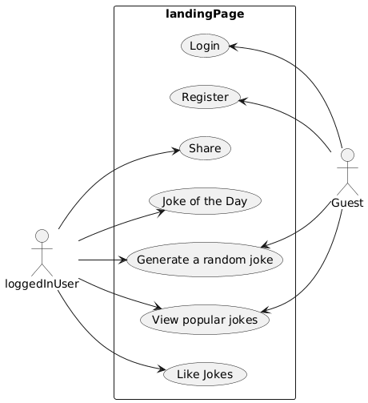

# Rendszerterv

## A rendszer célja

A rendszer célja, hogy a látogatók és felhasználók véletlenszerűen generált vicceket tudjanak lekérni. A látogatók regisztrálhatnak, a felhasználók bejelentkezhetnek, melyet követően lehetőség van a viccek kedvelésére. A kedveléskor az adott vicc bekerül az adatbázisba, mely alapján egy top jokes statisztika készül el. A weboldal egyszerű, reszponzív felületet kap a könnyen kezelhetőség érdekében. 

## Projektterv

**Ütemterv:**
|Funkció/Story | Feladat/Task | Prioritás | Becslés | Eltelt idő | Hátralévő idő | 
|:------------:|:------------:|:---------:|:-------:|:----------:|:-------------:|
|Követelmény specifikáció |Követelmények összegyűjtése és leírása | 0 | 2 | 2 | 0 |
|Rendszerterv | | 0 | 2 | 2 | 0 |
|Backend fejlesztés | | 1 | 12 | 0 | 12 |
|Frontend fejlesztés | | 1 | 12 | 0 | 12 |
|Tesztelés |Funkcionális és integrációs tesztek | 2 | 10 | 0 | 10 |

## Üzleti folyamatok modellje

## Követelmények

**Funkcionális követelmények:**
* **Látogatók**: 
  - Véletlenszerűen generált viccek lekérése
  - Regisztrációs lehetőség
  - Top viccek megtekintése

* **Regisztrált felhasználó**
  - Oldalra való bejelentkezés
  - Véletlenszerűen generált viccek lekérése
  - Viccek kedvelése
  - Top viccek megtekintése
  - Profiladatok módosítása
* **Adminisztrációs funkciók**
  - Felhasználók kezelése
  - Viccek statisztikáinak megtekintése
* **Rendszer funkciók**
  - Biztonságos hitelesítés
  - Adatbázisban viccek, kedvelések tárolása
  - Hibakezelés

**Nem funkcionális követelmények:**

* **Használhatóság:**

  - A rendszer felülete legyen egyszerű, áttekinthető és könnyen kezelhető.
  - A felület reszponzív legyen, azaz mobilon, tableten és asztali gépen is megfelelően működjön.

* **Biztonság:**

  - A jelszavakat titkosított formában kell tárolni az adatbázisban.
  - A rendszer védve legyen az alapvető támadásokkal szemben (pl. SQL injection, XSS).
  - Csak a bejelentkezett felhasználók férhetnek hozzá a kedvelési funkcióhoz.

* **Bővíthetőség és karbantarthatóság:**

  - A kód legyen jól dokumentált a könnyebb karbantartás érdekében.
  
**Törvényi előírások, szabványok:**
  - GDPR-nek való megfelelés.

## Funkcionális terv

**Rendszerszereplők:**
* Bejelentkezett felhasználó
* Látogató

**Rendszerhasználati esetek és lefutásaik:**

Bejelentkezett felhasználó:
* Lekérhet véletlenszerűen generált vicceket
* Kedvelheti a vicceket
* Megtekintheti a „Top Jokes” statisztikát
* Kijelentkezhet

Látogató:
* Regisztrálhat a rendszerbe
* Lekérhet véletlenszerűen generált vicceket
* Megtekintheti a „Top Jokes” statisztikát

## Fizikai környezet

## Architekturális terv

**Front-end:** A webalkalmazás front-endje a React JS könyvtár használatával készül el.

## Adatbázis terv

## Implementációs terv

**Web:** A webes felület főként HTML, CSS és Javascript nyelven fog készülni. Ezeket a technológiákat amennyire csak lehet külön fájlokba írva készítjük, és úgy fogjuk egymáshoz csatolni a jobb átláthatóság, könnyebb változtathatóság, és könnyebb bővítés érdekében.

## Tesztterv

## Telepítési terv

**Webes alkalmazás**: A szoftver webes felületéhez csak egy ajánlott böngésző telepítése szükséges (Google Chrome, Firefox, Opera, Safari), külön szoftver nem kell hozzá. A webszerverre közvetlenül az internetről kapcsolódnak rá a kliensek.

## Karbantartási terv

Az webalkalmazás folyamatos üzemeltetése és karbantartása, mely magában foglalja a programhibák elhárítását, a belső igények változása miatti módosításokat, valamint a környezeti feltételek változása miatt megfogalmazott program-, illetve állomány módosítási igényeket.

### Karbantartás:
- A felhasználók által felfedezett és "user reportban"elküldött hibák kijavítása.
- A program naprakészen tartása és finomhangolása. Perfective Maintenance: A szoftver hosszútávú használata érdekében végzett módosítások, új funkciók, a szoftver teljesítményének és működési megbízhatóságának javítása.
- Olyan problémák elhárítása, amelyek még nem tűnnek fontosnak, de később komoly problémákat okozhatnak.

